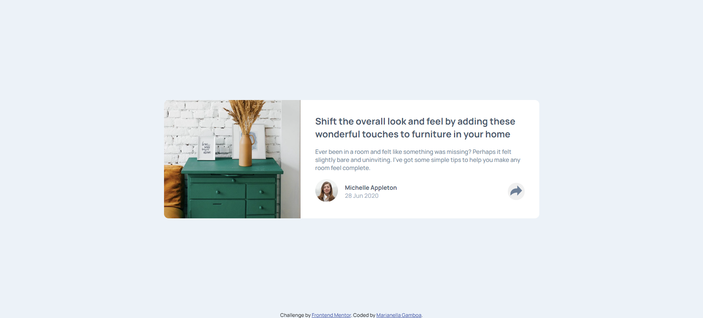
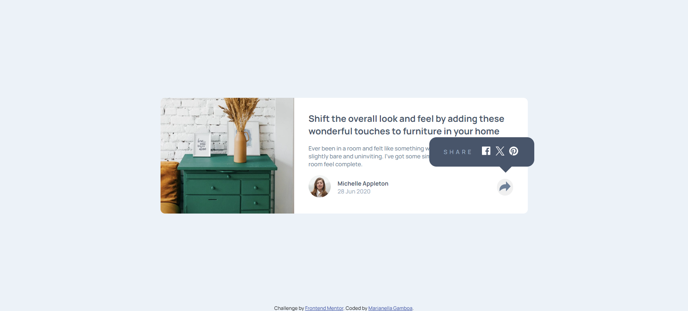
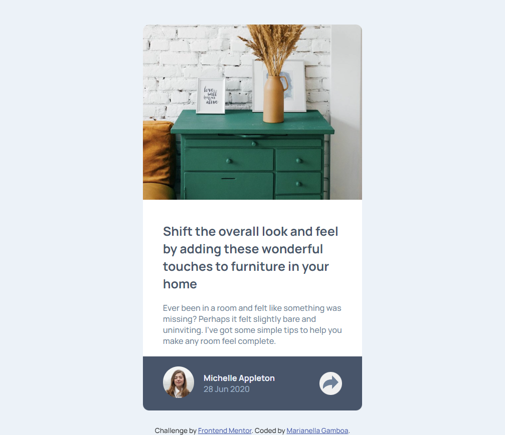

# Frontend Mentor - Article preview component solution

This is a solution to the [Article preview component challenge on Frontend Mentor](https://www.frontendmentor.io/challenges/article-preview-component-dYBN_pYFT). Frontend Mentor challenges help you improve your coding skills by building realistic projects. 

## Table of contents

- [Overview](#overview)
  - [The challenge](#the-challenge)
  - [Screenshot](#screenshot)
  - [Links](#links)
- [My process](#my-process)
  - [Built with](#built-with)
  - [What I learned](#what-i-learned)
  - [Useful resources](#useful-resources)
- [Author](#author)
- [Acknowledgments](#acknowledgments)

## Overview

### The challenge

Users should be able to:

- View the optimal layout for the component depending on their device's screen size
- See the social media share links when they click the share icon

### Screenshot





### Links

- Live Site URL: [live site URL](https://marianellag1.github.io/article-preview-challenge/)

## My process

### Built with

- Semantic HTML5 markup
- CSS custom properties
### What I learned
Its so helpful to look at others code for the same challenge and compare on what I can improve or use less of. For codes in which I don't have the knowledge imagining how to even start, but I can use them on my code and change a thing or two, its just the best. And I learn from that, these are some codes I learned and with this new knowledge, for anything similar, I now know how to use them and when they need to be used. A lot of bable, but I understand myself.

```css
.share-box {
    position: absolute;
    display: flex;
    gap: 15px;
    right: -47px;
    top: -85px;
    padding: .50rem 2rem;
    border-radius: 16px;
    background-color: var(--very-dark-grayish-blue);
    align-items: center;
}

.share-box:after {
    content: " ";
    position: absolute;
    right: 50px;
    bottom: -14px;
    border-top: 15px solid var(--very-dark-grayish-blue);
    border-right: 15px solid transparent;
    border-left: 15px solid transparent;
    border-bottom: none;
  }
```
```js
var hiddenIcon = document.getElementById("hidden-icon");
var arrowBtn = document.getElementById("btn");

arrowBtn.addEventListener("click", (e) => {
    hiddenIcon.classList.toggle('hidden');
})
```

### Useful resources

- [devcamp](https://devcamp.com/trails/javascript-in-the-browser/campsites/javascript-dom/guides/how-to-use-javascript-s-toggle-function) - Really good site for some simple example on javascript code for the toggle part of the challenge.
- [w3schools](https://www.w3schools.com/howto/tryit.asp?filename=tryhow_js_toggle_class) - Also a good site. This one is useful for onclick button on html.
- [w3schools](https://www.w3schools.com/css/css3_mediaqueries.asp) - Best for media query example. Just get the code given, and play around. Very helpful.
- [CODECONVEY](https://codeconvey.com/css-message-box-with-arrow/) - Great site for bottom arrow on share box.

## Author

- Frontend Mentor - [@Marianellag1](https://www.frontendmentor.io/profile/Marianellag1)

## Acknowledgments

Credit where credit is due. A big part of where my code came after a while struggling with how to start on javascript and how to go about it, is with [borys25ol](https://github.com/borys25ol/frontend-mentor-challenges/blob/master/article-preview-component/index.html). Looking at his code helped extremely on what I can do better on my code, as well as how javascript should work. Expecially when using Devtools.

